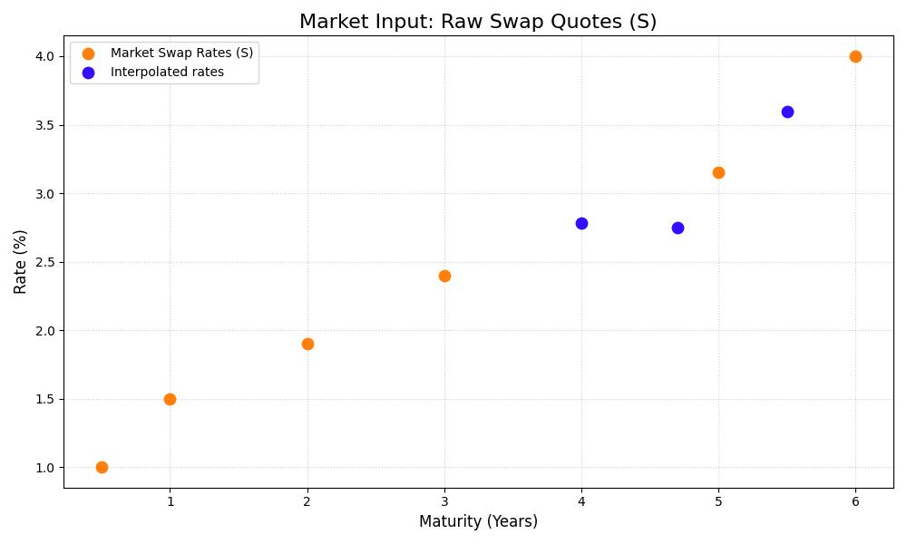
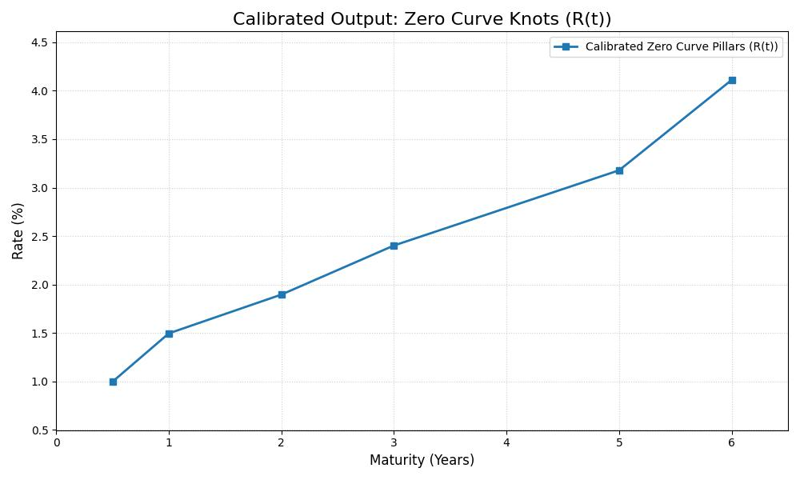

# Project Documentation: Yield Curve Bootstrapping

This project implements the **Bootstrapping technique** to construct a **Zero Coupon Interest Rate Curve (Discount Curve)** using market-quoted Interest Rate Swap (IRS) rates.

---

# I. Notation

| Variable | Description |
|---------|-------------|
| $T$ | Time to maturity (in years). |
| $t_i$ | The $i$-th cash flow date. |
| $DF(T)$ | The Discount Factor for time $T$. |
| $r(T)$ | The Zero Rate (Spot Rate) for time $T$ (continuously compounded). |
| $\tau_i$ | The time fraction of the accrual period $[t_{i-1}, t_i]$. |
| $S$ | The fixed Par Swap Rate quoted by the market. |
| $N$ | The Notional Principal (typically $1.0$ for valuation). |
| $PV$ | Present Value. |

**Relationship between Zero Rate and Discount Factor:**

$$
DF(T) = e^{-r(T)\, T}
$$

---

# II. Core Assumptions

- **Instrument Set:**  
  The curve is built using short-term Zero Coupon Bonds (ZCBs) followed by Interest Rate Swaps.

- **Payment Frequency:**  
  All swap fixed legs have semi-annual payments ($\tau = 0.5$).

- **Day Count Convention:**  
  Time is measured in exact years (Actual/Actual or similar).

- **Initial ZCB:**  
  The shortest maturity (0.5Y) comes from a money-market deposit treated as a ZCB.

- **Interpolation:**  
  Linear interpolation applied to Zero Rates $r(T)$ between calibrated pillars.

- **No Spread:**  
  Floating leg has no credit spread.

---

# III. Present Value Formulas

## A. Fixed Leg Present Value

The fixed leg is a stream of constant payments:

$$
PV_{\text{Fixed}} = N S \sum_{i=1}^n \tau_i \ DF(t_i) 
$$

Where:
- $n$ = number of periods  
- $\tau_i$ = accrual fraction  

---

## B. Floating Leg Present Value

Using the replication argument:

$$
PV_{\text{Floating}} = N(1 - DF(T_n)).
$$

### Derivation (Telescoping Sum)
Using the forward rate $F(t_{j-1},t_j) = \frac{1}{\tau_j}\left(\frac{DF(t_{j-1})}{DF(t_j)} - 1\right)$ between paiment dates

$$
PV_{\text{Floating}}
= \sum_{i=1}^{n} N \tau_j F(t_{j-1},t_j) D(t_{j})
=  \sum_{i=1}^{n} N DF(t_{j-1}) - DF(t_j) = N (1- DF(t_n)).
$$


---

## IV. The Bootstrapping Process (Calibration via Secant Method)

Bootstrapping solves for each unknown discount factor recursively. We calculate the Zero Rate $r(T_n)$ for the pillars ($T_n$) provided by the swap inputs.

The core principle is that the swap is initiated at zero Net Present Value (NPV):

$$PV_{\text{Fixed}} = PV_{\text{Floating}} \quad \implies \quad PV_{\text{Floating}} - PV_{\text{Fixed}} = 0$$

### A. The Root-Finding Problem

When intermediate coupon dates require interpolation, the interpolation itself relies on the unknown rate $r(T_n)$.  
This creates a circular dependency, making the closed-form algebraic solution invalid.

We reformulate the problem as finding the root of a function $f(r)$:

$$\mathbf{f(r) = PV_{\text{Floating}}(r) - PV_{\text{Fixed}}(r)}$$

We seek the Zero Rate $r$ at maturity $T_n$ such that $f(r) = 0$.

---

### B. The Secant Method

The Secant Method approximates the solution without requiring the derivative of $f(r)$.
The method starts with two initial guesses for the unknown rate ($r_0, r_1$) and iterates toward convergence.
The update formula for the next rate guess ($r_{k+1}$) is:

$$\mathbf{r_{k+1} = r_k - f(r_k) \frac{r_k - r_{k-1}}{f(r_k) - f(r_{k-1})}}$$

Where:

- $r_k$ is the current guess for the Zero Rate at $T_n$  
- $f(r_k)$ is the NPV error calculated by temporarily setting $r(T_n) = r_k$ on the curve  

This iterative process is repeated sequentially for every swap maturity, ensuring that the interpolation dependency is handled correctly at every step.

---

# V. Market Input Data

## --- Input Swap Quotes (Including ZCB Placeholder) ---

| Maturity (Years) | Market Rate (%) | Description |
|------------------|------------------|-------------|
| 0.5  | 1.0000 | Initial ZCB (money-market deposit) |
| 1.0  | 1.5000 | Swap Quote |
| 2.0  | 1.9000 | Swap Quote |
| 3.0  | 2.4000 | Swap Quote |
| 5.0  | 3.1500 | Swap Quote |
| 6.0  | 4.0000 | Swap Quote |

### Corresponding C++ Structure

```cpp
double zcb_0_5_rate = 0.0100;

vector<SwapQuote> marketData = {
    SwapQuote(0.5, zcb_0_5_rate), // Placeholder for ZCB
    SwapQuote(1.0, 0.0150),
    SwapQuote(2.0, 0.0190), 
    SwapQuote(3.0, 0.0240),
    SwapQuote(5.0, 0.0315),
    SwapQuote(6.0, 0.0400),
};
```

## --- Bootstrapping Calibration Results ---

| Maturity (Y) | Calibrated Zero Rate |
|--------------|-----------------------|
| 1.000000     | 1.496269% |
| 2.000000     | 1.896485% |
| 3.000000     | 2.402950% |
| 5.000000     | 3.178973% |
| 6.000000     | 4.111352% |

---

## --- Verification of the Swap NPVs ---

| Maturity (Y) | Market Rate | Fair Rate | NPV | Note |
|--------------|-------------|-----------|------|------|
| 0.5000 | 1.0000% | 1.0000% | -1.344e-16 | should be near 0 |
| 1.0000 | 1.5000% | 1.5000% | -9.741e-14 | should be near 0 |
| 2.0000 | 1.9000% | 1.9000% | -8.332e-13 | should be near 0 |
| 3.0000 | 2.4000% | 2.4000% | -2.420e-11 | should be near 0 |
| 5.0000 | 3.1500% | 3.1500% | -1.588e-14 | should be near 0 |
| 6.0000 | 4.0000% | 4.0000% | -3.079e-13 | should be near 0 |


# VI. Figures

## **Figure 1 — Market Swap Rates and Interpolated Fair Swap Rates**

This figure shows:
- The **market-quoted swap rates** (the inputs)
- The **interpolated/fair swap rates** derived from the bootstrapped zero curve



---

## **Figure 2 — Bootstrapped Zero Coupon Curve (Zero Rates)**

This figure shows:
- The calibrated **zero rate pillars** (output of the bootstrap)
- The shape of the resulting **zero curve**



---
